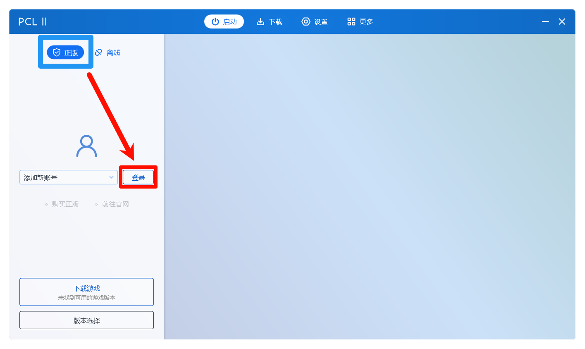
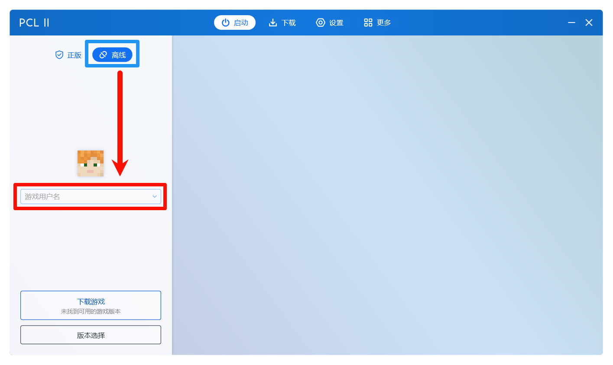

# 账号和启动游戏

本篇将教你区分第三方启动器中登录正版或离线的区别和登录方式。

## 登录账号

PCL 2 为我们提供了两种账号登录方式，一个是正版，一个是离线，这两个有什么区别？

* 正版: 使用你已购买 Minecraft 的微软账号登录，没购买则无法登录
* 离线: 如果没钱买正版可以选择离线登录，离线登录需要你随便起一个名字，**注意离线登录无法进入启用了正版验证的服务器，也无法使用游戏自带的 Realms (领域) 功能，所更换的皮肤在服务器上其他人看不到**

如果要正版登录，点击 PCL 2 **启动**主页的**正版**：

点击 **添加新账号** 左边的 **登录** 即可调动登录接口，按照提示一步一步登录自己的微软账号即可。

如果要是用离线登录，点击 PCL 2 **启动**主页的**离线**：

在下方的 **游戏用户名** 写上你想要的名字，即可作为离线账号登录。

## 启动游戏

游戏下载完之后，账号也登录好了的话，就可以直接点击左下角的 "启动游戏" 按钮开始畅玩 Minecraft 了！