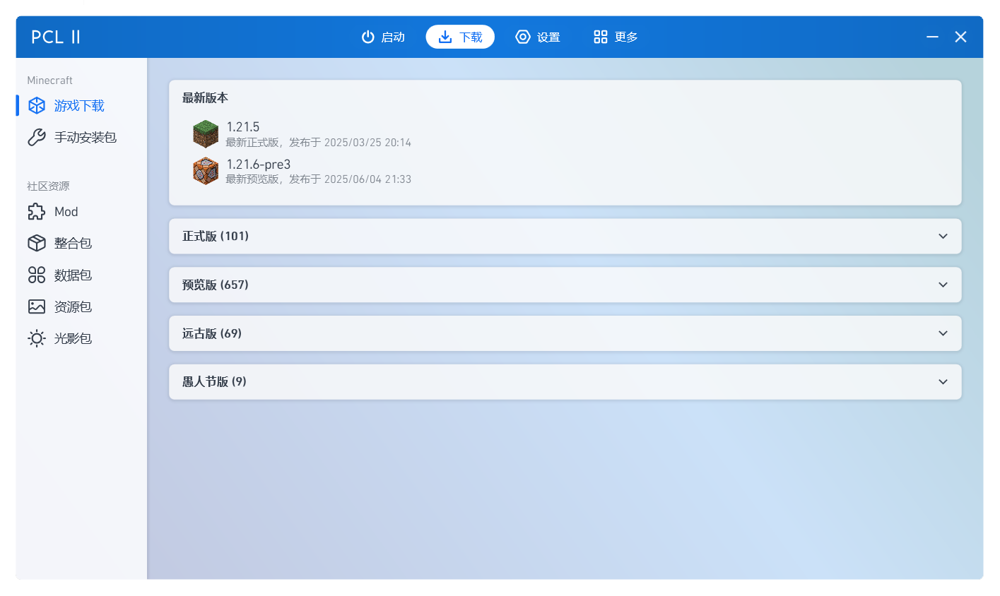
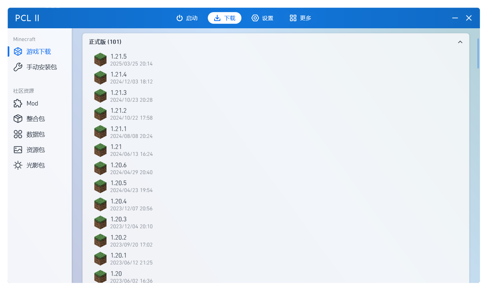
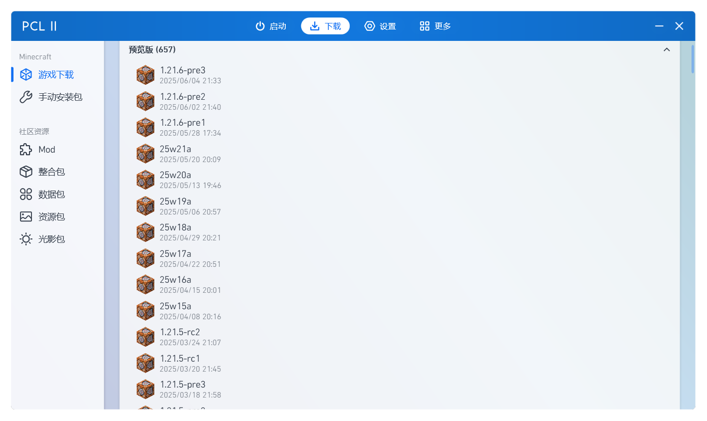
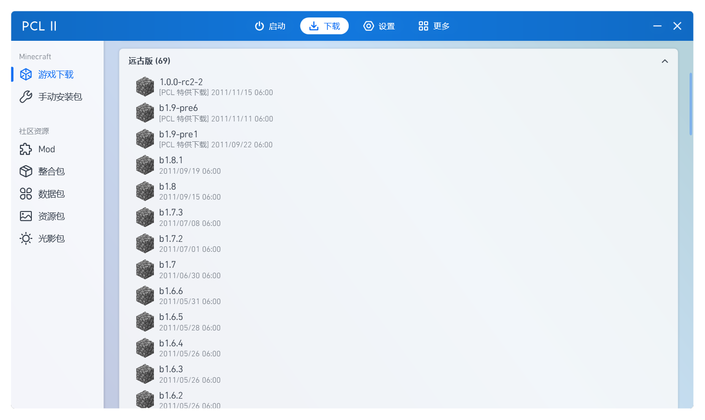
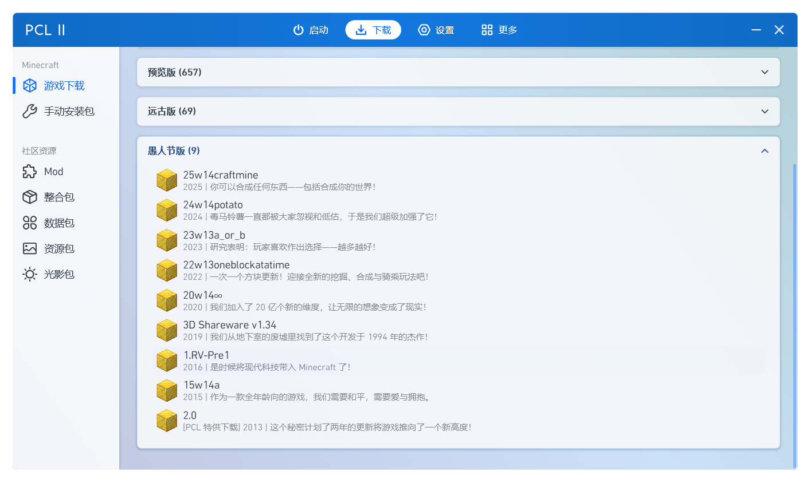
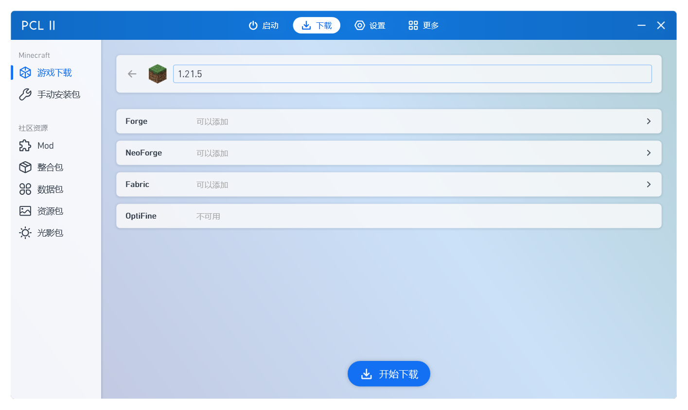
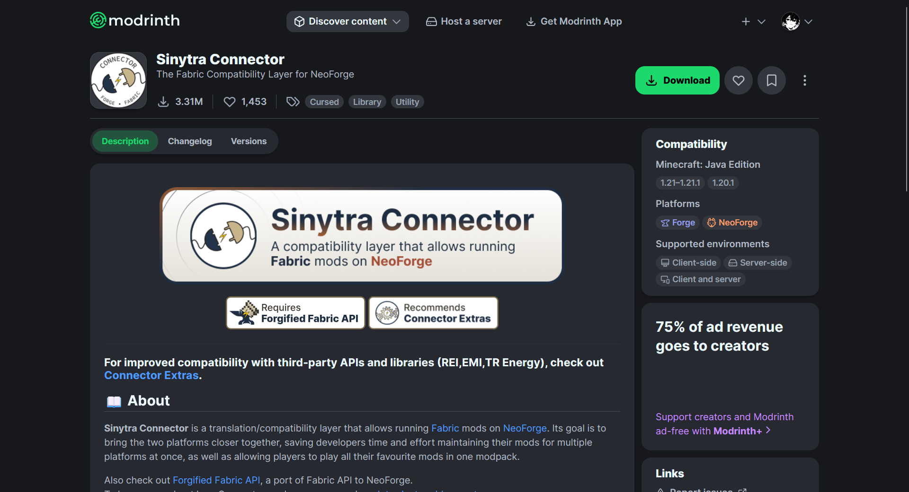
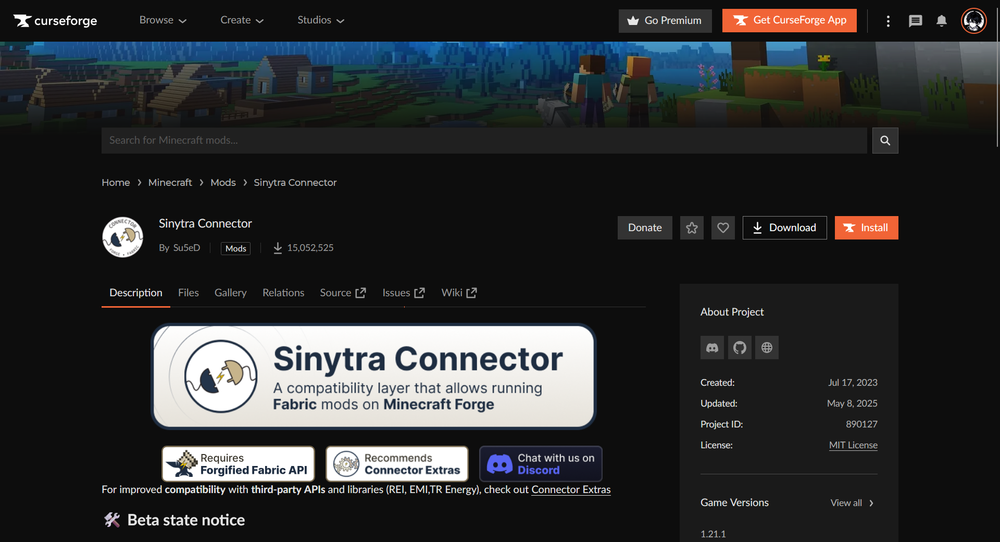

# 下载游戏

本章节将会教会你区分游戏版本，使用第三方启动器下载游戏和认识一些扩展组件。

## 选择游戏版本

在进行游戏之前，首先需要你下载一个游戏版本。让我们点击上方的 "下载"。

这么多游戏版本，该下载哪一个好呢？一般对于新手来说，选择最新正式版本就行了。如果你希望玩模组，那么建议你选择 1.7.10/1.12.2/1.16.5/1.18.2/1.20.4 这些模组较多的热门版本。

如果想要尝鲜，体验一下当小白鼠的感觉的话，可以选择下载预览版本（预览版本一般是 1.X.X-preXX）。如果觉得预览版本还不够新，可以选择快照版本 (快照版本的命名通常为 XXwXXa)，快照版本通常每周发布一次，也是最不稳定的版本。通览版和快照版本虽然有模组 (一般是 Fabric)，但是模组适配的数量极其稀少。

如果想要怀旧，想当一名考古学家，探索一下旧版本 Minecraft 的内容，可以选择远古版。目前 PCL 2 的远古版本全部为 2012 年之前的 Minecraft 版本。

当然，还有一年一度的愚人节版本，一般是mojang基于现有的正式版，然后往里面加超级多的蜜汁小料😋，算是 Mojang 给各位开的玩笑，有很多有趣的玩法，属于官方整活了。

我们这里以当前以25年3月25日发布的最新正式版 1.21.5 为例。点进去之后，可以看到下面四个方框的**扩展内容**，这些都是什么呢：

* Forge: 模组加载器。通常大型模组都使用的是 Forge 而不是 Fabric。相比 Fabric 来说优化模组没那么多，启动速度也略逊于 Fabric。
* Fabric: 也是一个模组加载器，自从高版本 (1.16.5+) 后便成为与 Forge 不相上下的热门模组加载器。相比 Forge 来说，Fabric 虽然没有什么大型模组，但是它的优化模组数量是远超过 Forge 的。
* NeoForge: 1.20.1 后因为 Forge 开发团队部分开发者对 Forge 的领头人不满，基于 Forge 开发的一个模组加载器。NeoForge 与原 Forge 有着不同的发展路线。NeoForge 全新的架构和API让他在 1.21 以上版本十分吃香，从体验和性能能够超过 Forge。
* Optifine: 老牌优化模组，能够大幅度提升游戏帧数，并添加光影，是高版本之前的必装模组之一。但是高版本后 Optifine 的兼容性越来越糟糕，甚至经常会出现 OpenGL 错误。建议高版本玩家首选 Sodium (Fabric) 和 Embeddium (Forge)。想添加光影可以选择 Iris (Fabric) 和 Oculus (Forge)。

Forge 与 Fabric 不可共存，只能选择其中之一。Fabric 不可添加 Forge 的模组，但 Forge 可以通过 [信雅互联](https://www.mcmod.cn/class/11627.html) 运行 Fabric 的大部分模组，可自行研究。

import Tabs from '@theme/Tabs';

import TabItem from '@theme/TabItem';

:::tip[这是“信雅互联”模组在热门模组平台的页面：]

<Tabs>
  <TabItem value="mcmod" label="MC百科"></TabItem>
  <TabItem value="modrinth" label="Modrinth"></TabItem>
  <TabItem value="curseforge" label="CurseForge"></TabItem>
</Tabs>

:::

关于模组内容的更多信息，比如说如何安装模组，模组加载器的选择，都可以在后续的 [模组](https://docs.buku.wiki/PC/mod) 章节找到这些。

“**前面的世界，以后再来探索吧！**”

一切准备好之后，点击下方的 "开始下载" 按钮，就可以下载你选择好的版本啦！
