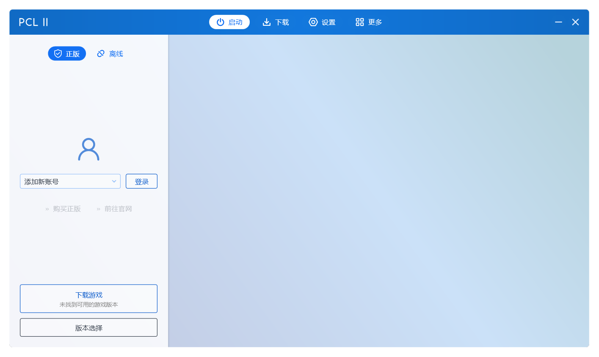
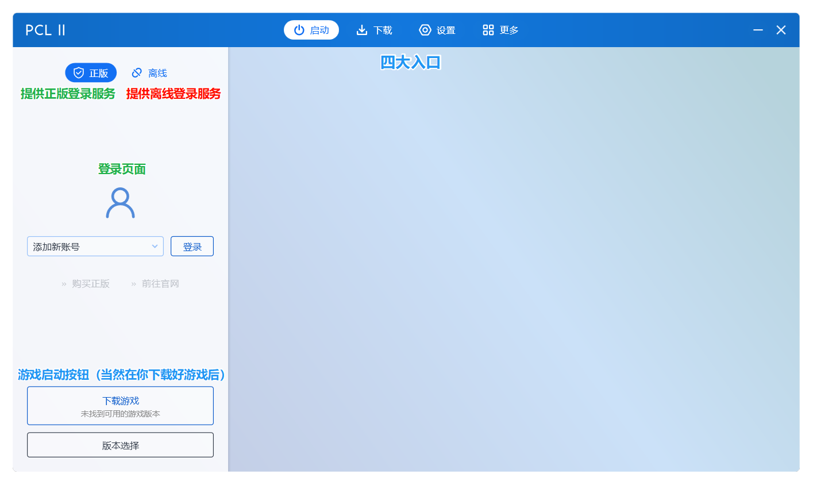
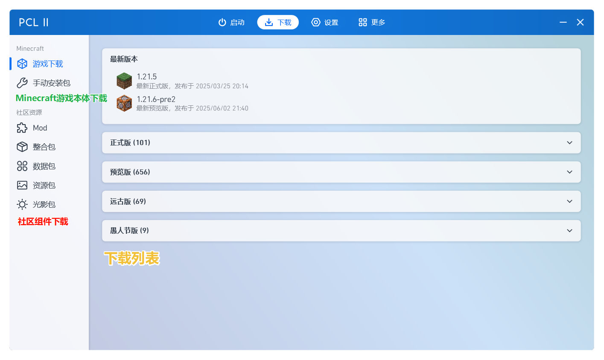
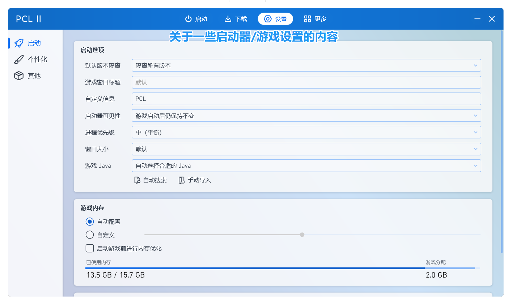
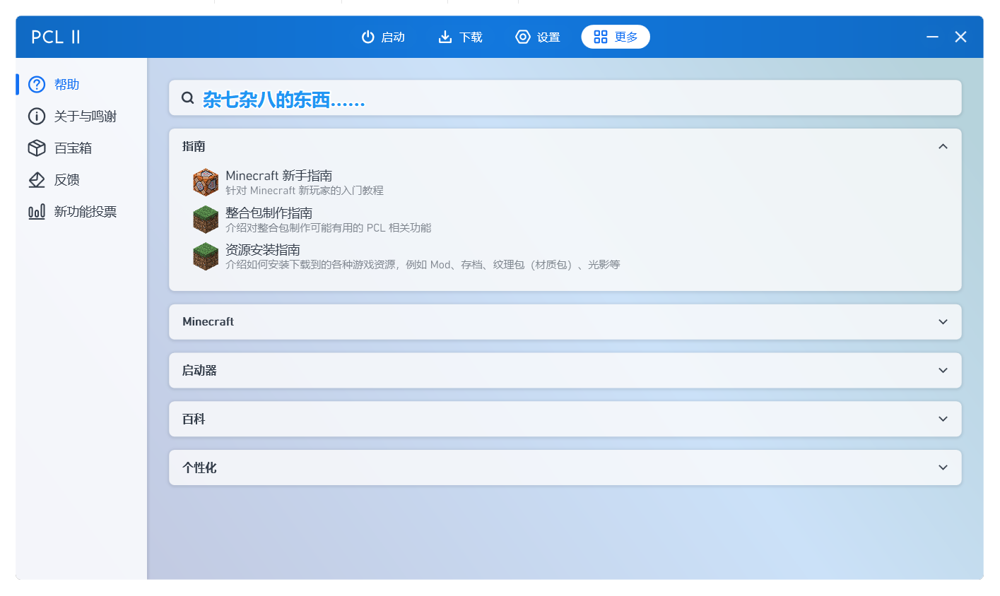

# 认识启动器

在开始阶段章节中，想必你已经挑选了自己喜欢的启动器。

我们依旧以PCL2为例，带你了解启动器中的一些重要的通用配置，帮助你快速启动第一个Minecraft游戏客户端。

:::tip

我们依旧推荐你**使用PCL2启动器**，因为让**足够强大且稳定**。

如果你使用的是其他第三方启动器，其设置可能在其他设置入口，但大差不差，多找找就好。

:::

打开 PCL2 之后，你会看到如下界面。

这便是 PCL2 启动器的主页，接下来我会帮助你快速认识这个启动器：

:::tip

PCL2的大部分选项都带有 ToolTip（功能提示），你可以把鼠标放在上面以获得提示。

::: 

这便是PCL2的四大主页，所有的功能均被分类，可以很快速的找到他们，你可以自行探索其中的功能。

