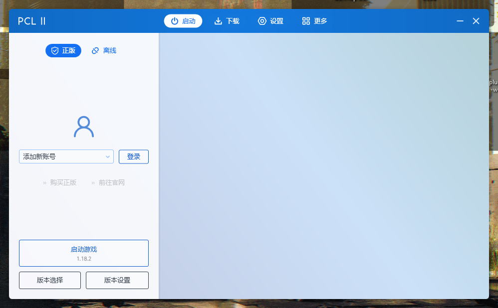
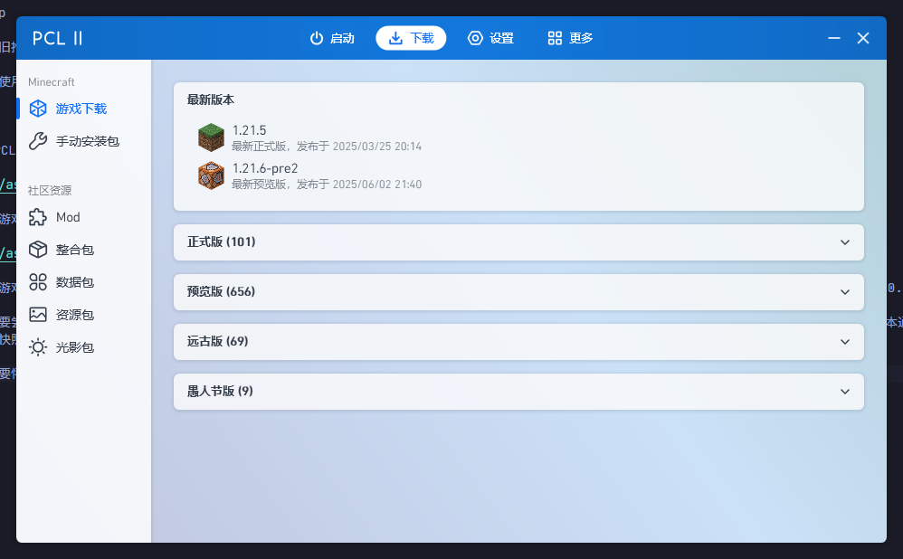
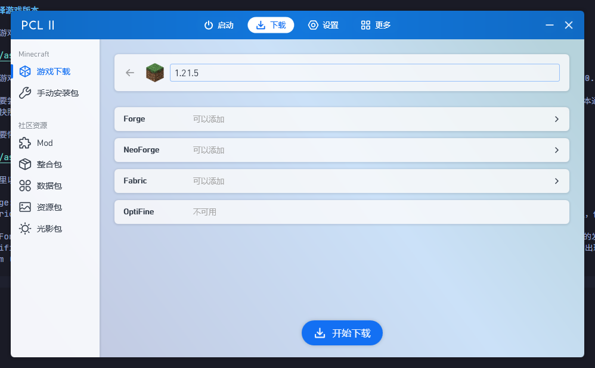

# 认识启动器

在开始阶段章节中，想必你已经挑选了自己喜欢的启动器。

我们依旧以PCL2为例，带你了解启动器中的一些重要的通用配置，帮助你快速启动第一个Minecraft游戏客户端。

:::tip

我们依旧推荐你**使用PCL2启动器**，因为让**足够强大且稳定**。

如果你使用的是其他第三方启动器，其设置可能在其他设置入口，但大差不差，多找找就好。

:::

打开 PCL 2 之后，你会看到如下界面。

## 选择游戏版本

在进行游戏之前，首先需要你下载一个游戏版本。让我们点击上方的 "下载"。

这么多游戏版本，该下载哪一个好呢？一般对于新手来说，选择最新正式版本就行了。如果你希望玩模组，那么建议你选择 1.7.10/1.12.2/1.16.5/1.18.2/1.20.4 这些模组较多的热门版本。

如果想要尝鲜，体验一下当小白鼠的感觉的话，可以选择下载预览版本。如果觉得预览版本还不够新，可以选择快照版本 (快照版本的命名通常为 XXwXXa)，快照版本通常每周发布一次，也是最不稳定的版本。通览版和快照版本虽然有模组 (一般是 Fabric)，但是模组适配的数量极其稀少。

如果想要怀旧，想当一名考古学家，探索一下旧版本 Minecraft 的内容，可以选择远古版。目前 PCL 2 的远古版本全部为 2012 年之前的 Minecraft 版本。

我们这里以当前 (25.06.02) 最新的正式版本 1.21.5 为例。点进去之后，可以看到下面四个方框的内容，这些都是什么呢？

* Forge: 模组加载器。通常大型模组都使用的是 Forge 而不是 Fabric。相比 Fabric 来说优化模组没那么多，启动速度也略逊于 Fabric。
* Fabric: 也是一个模组加载器，自从高版本 (1.16.5+) 后便成为与 Forge 不相上下的热门模组加载器。相比 Forge 来说，Fabric 虽然没有什么大型模组，但是它的优化模组数量是远超过 Forge 的。
* NeoForge: 1.20。1 后因为 Forge 开发团队部分开发者对 Forge 的领头人不满，基于 Forge 开发的一个模组加载器。NeoForge 与原 Forge 有着不同的发展路线。
* Optifine: 老牌优化模组，能够大幅度提升游戏帧数，并添加光影，是高版本之前的必装模组之一。但是高版本后 Optifine 的兼容性越来越糟糕，甚至经常会出现 OpenGL 错误。建议高版本玩家首选 Sodium (Fabric) 和 Embeddium (Forge)。想添加光影可以选择 Iris (Fabric) 和 Oculus (Forge)。

Forge 与 Fabric 不可共存，只能选择其中之一。Fabric 不可添加 Forge 的模组，但 Forge 可以通过 [信雅互联](https://www.mcmod.cn/class/11627.html) 运行 Fabric 的大部分模组。

一切准备好之后，点击下方的 "开始下载" 按钮。

## 登录账号

在等待游戏下载之余，可以看下账号的登录了。PCL 2 为我们提供了两种账号登录方式，一个是正版，一个是离线，这两个有什么区别？

* 正版: 使用你已购买 Minecraft 的微软账号登录，没购买则无法登录
* 离线: 如果没钱买正版可以选择离线登录，离线登录需要你随便起一个名字，**注意离线登录无法进入启用了正版验证的服务器，也无法使用游戏自带的 Realms (领域) 功能，所更换的皮肤在服务器上其他人看不到**

这里以正版登录为例，点击 "登录"，按照启动器的指引进行登录即可。*请放心，PCL 2 是不会盗你的号的，不放心可以去 [PCL 2 的 GitHub 仓库](https://github.com/Hex-Dragon/PCL2) 拉取源码然后自己编译一个去用*

## 启动游戏

游戏下载完之后，账号也登录好了的话，就可以直接点击左下角的 "启动游戏" 按钮开始畅玩 Minecraft 了！