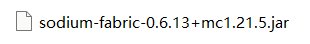

# 认识模组和模组加载器

模组 (Mod)，作为扩展 Minecraft 的最常用的方式，它可以向 Minecraft 添加各种各样的内容。没有它做不到，只有你想不到。现如今，模组已经发展成一个庞大的社区供玩家使用。所以，本章内容将带你认识加载进 Minecraft 的模组加载器和模组。

## 什么是模组加载器？

模组加载器 (Mod Loader) ，顾名思义，就是用来把模组文件加载进 Minecraft 本体。

模组加载器在时间流逝中，衍生出了很多分支，我们先来看看有哪些模组加载器，以及他们的优势：

| 加载器名称 | 加载器简介                                                   | 适用版本       | 推荐使用版本                       |
| ---------- | ------------------------------------------------------------ | -------------- | ---------------------------------- |
| Fabric     | 半壁江山的轻量级别加载器，虽说是轻量，但仍然受欢迎，模组市场庞大 | 全版本         | 辅助模组或轻量扩展游戏首选         |
| Forge      | 最经典的重型模组加载器，适配全版本，模组市场同样庞大         | 全版本         | 1.20 以下仍旧强势                  |
| Quilt      | 由社区爱好者维护的 Fabric 分支，拥有一些 Fabric 未有的先进内容，可以兼容 Fabric 模组，但不是完全原版 Fabric 的 API，有一些模组不适配 | 1.21.6 - 1.14  | 兼容性良好，喜欢社区可以选择该版本 |
| NeoForge   | 因为 Forge 的团队闹事，Forge 的原成员大多数都加入了 NeoForge 中。NeoForge 算是一个 Forge 的重制版本，在 1.21 版本以上便开始优化原 Forge 的 API，模组兼容性良好，但仍然建议在1.21以上使用。 | 1.21.5 -1.20.1 | 1.21 以上首选，社区维护            |
| LiteLoader | 一个在低版本提供轻量加载，适合轻量扩展功能，类似于小地图这种辅助模组 | 1.12.2 - 1.3.2 | 停更，模组较少，不大推荐           |

你可以选择自己想要游玩的版本来选择对应的加载器来安装适用。

## 什么是模组文件？

模组文件 (Mod File) 就是加载进游戏的内容。*这他妈在说什么*

一般来说，你只需要让模组加载器加载这个模组，它就会在游戏里起到作用。

现如今的模组文件后缀一般为 .jar，这是最常见的后缀。这是一个经典 Fabric 1.21.5 平台 游戏性能优化模组 Sodium 的样子：

它的名称是 `sodium-fabric-0.6.13+mc1.21.5.jar`

由于模组名称没有有一个规范，但一般来说模组名称都会有这些内容，我们继续以这个 Sodium 模组为例，我们来看看它的命名方式：

当然，不可能所有的模组都是一个命名方式，但也大差不差，自己分辨一下就好。
