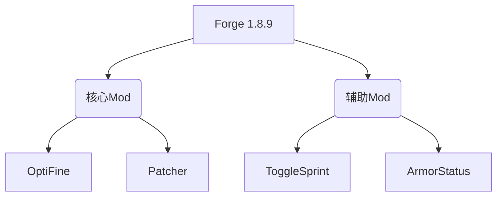

> 专为新手打造的PvP进阶手册：从客户端选择到战斗精通

## 什么是PvP客户端？
**PvP客户端**是基于Minecraft原版客户端深度优化的专用程序，集成了性能优化、战斗辅助、界面美化等模块。在1.8版本这个PvP黄金时代，使用专业客户端能显著提升战斗流畅度与操作精度。

## 主流PvP客户端详解

下表对比了四大主流客户端的核心特性：


| **客户端名称**     | **核心优势**                      | **适用场景**                 | **下载地址**                        |
| ------------------ | --------------------------------- | ---------------------------- | ----------------------------------- |
| **Badlion Client** | 反作弊系统、实时护甲监控、FPS优化 | 竞技场公平对战、大型赛事     | [官网链接](https://www.badlion.net) |
| **Lunar Client**   | 超流畅动画、低输入延迟、简洁UI    | 高帧率需求、技巧型玩家       | [官网链接](https://lunarclient.com) |
| **LabyMod**        | 高度自定义HUD、社交系统整合       | 社区型服务器、个性化界面需求 | [官网链接](https://www.labymod.net) |
| **Forge+PVP Mods** | 自由组合模组、深度定制            | 技术型玩家、特定功能需求     |                                     |

### 1. Badlion Client（现已经被Lunar收购）

- **性能优化**：通过OpenGL重构渲染管线，中低配设备可达**200+ FPS**
- **战斗辅助**：
  - 盔甲耐久实时监控
  - 粒子效果简化（清晰显示暴击粒子）
  - 连击计数器与CPS显示
- **安装步骤**：
  1. 官网下载安装器（需加速器访问）
  2. 选择`1.8.9`版本安装
  3. 首次启动自动配置优化参数

### 2. Lunar Client

- **闪电响应**：输入延迟低于**5ms**，特别适合需要微操作的玩家
- **特色功能**：
  - 动态准星（根据攻击冷却变化）
  - 动画皮肤系统（武器挥动轨迹可视化）
  - 一键切换资源包

### 3. 传统方案：Forge+优化Mod组合

适合喜欢深度定制的玩家：



**必备Mod清单**：

- **OptiFine**：基础光影支持与性能优化
- **5Zig**：综合HUD（坐标/CPS/延迟显示）
- **Orange's SimpleMods**：轻量级快捷键管理

---

## 客户端安装全流程

### 环境准备

1. **Java配置**：
   - 必须使用 **Java 8**（推荐AdoptOpenJDK）
   - 验证命令：`java -version`
2. **游戏本体**：
   - 官方启动器安装1.8.9版本
   - 确认游戏能正常启动

### Badlion安装示例

```bash
# Windows系统
双击badlion-setup.exe
选择安装路径为 .minecraft/badlion

# macOS/Linux
java -jar Badlion_Client.jar
```

> 安装后首次启动需10分钟加载资源库，请勿中断

### 防封禁指南

- ❌ 禁止使用自动点击、透视类Mod
- ✅ 安全功能：
  - 按键显示（合法）
  - 伤害粒子高亮（合法）

---

## 核心PvP技巧精要

### 1. 走位艺术

- **W-tap**：攻击后短暂松**W**重置连击（控距核心）
- **S-tap**：急停闪避+反击（克制激进对手）
- **Circle-Strafing**：绕圈走位（针对低灵敏度玩家）

### 2. 点击优化


| **点击方式**   | **CPS范围** | **操作要点** |
| -------------- | ----------- | ------------ |
| 常规点击       | 5-7         | 手腕发力     |
| 蝴蝶点击（BC） | 12-15       | 双指交替点击 |
| 拖拽点击（DC） | 15+         | 手指滑过按键 |

> 新手建议从**蝴蝶点**（BC）起步，逐步提升至10 CPS

### 3. 实战策略

- **连招起手**：跳跃攻击+落地连击（附加击退）
- **地形利用**：
  - 高地优势（+10%伤害）
  - 水域减速（限制走位）
- **道具衔接**：
  - 末影珍珠突进
  - 喷溅药水控场

---


## 资源大全

### 必备资源包

- **Default 16x**（原版高清化）
- **TimeDeo 2k**（技能粒子优化）
- **SammyGreen**（UI对比度增强）

### 训练地图

1. **PVPLegacy**：连击/走位训练场
2. **Minemen Club**：天梯对战平台
3. **Reddit r/MinecraftPVP**：战术讨论区

> **提示**：每日30分钟靶场训练，两周内胜率提升60%！

---

## 疑难排解

**Q1：启动后FPS不升反降？**
✅ 检查显卡驱动更新
✅ 关闭客户端内建光影
✅ 删除`options.txt`重置设置


**Q2：Mod冲突崩溃？**

1. 移除所有Mod
2. 逐个添加排查
3. 查看`.minecraft/crash-reports`

---

> 掌握客户端只是起点，真正的强者在战场诞生！现在开启你的第一场排位赛吧！
> 最后更新：2025-06-04
> 数据来源：Hypixel官方统计、Lunar性能白皮书、MC社区调研
> sidebar_position: 2

---
