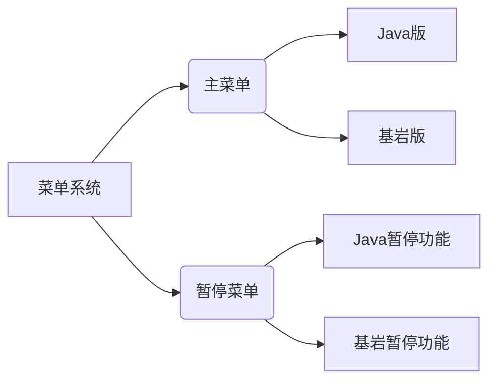
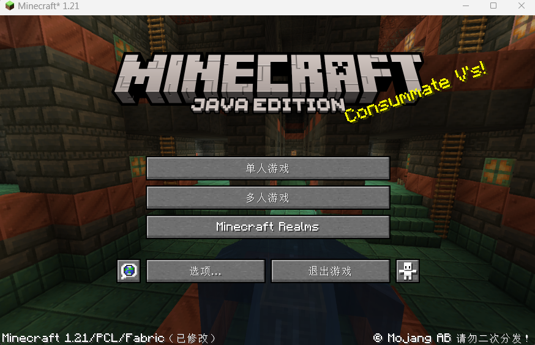
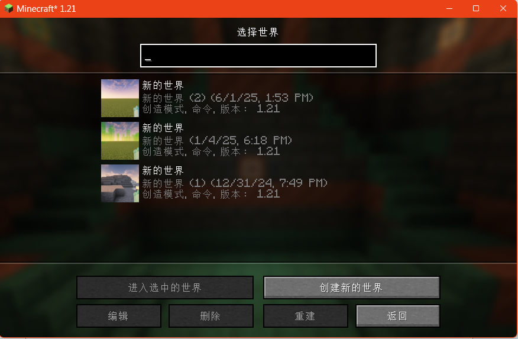
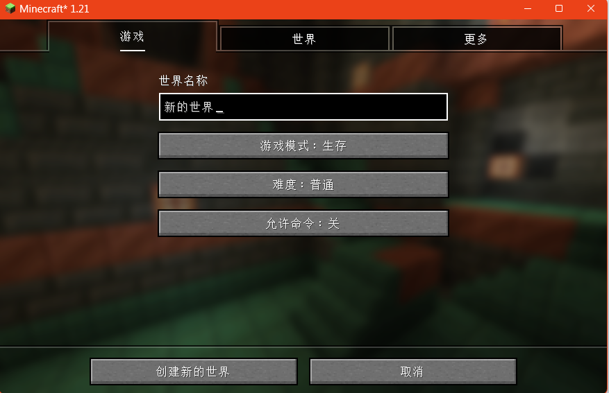
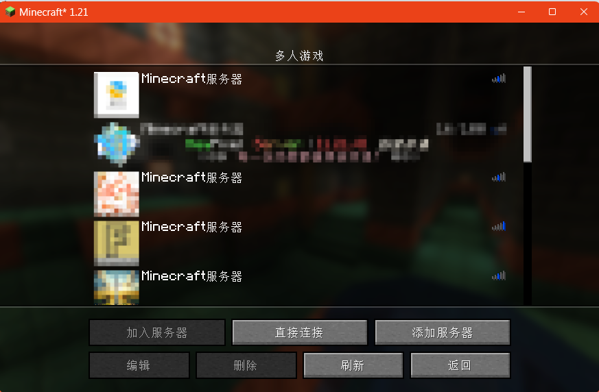

# 游玩时间

很好，看来你已经启动了你的第一个 Minecraft 游戏，本章节将会教会你基本的游戏操作和功能，帮助你快速体验上原汁原味的 Minecraft。

# Minecraft 菜单界面完全指南  
> **Java 1.21 版本详解**

## Java版菜单系统

### 主菜单界面

*1.21版本主菜单全景背景与功能布局*

| 功能按钮             | 作用描述               |
| -------------------- | ---------------------- |
| **单人游戏**         | 进入存档管理界面       |
| **多人游戏**         | 加入服务器或局域网游戏 |
| **Minecraft Realms** | 访问官方Realms服务器   |
| **地球图标**         | 切换游戏语言           |
| **选项**             | 调整游戏设置           |
| **退出游戏**         | 关闭游戏程序           |
| **小人图标**         | 辅助功能设置           |

---

### 单人游戏系统

#### 世界管理功能

| 界面元素   | 说明                         |
| ---------- | ---------------------------- |
| 世界名称   | 自定义显示名称               |
| 世界文件名 | 存档文件夹名称（创建时设置） |
| 更多信息   | 显示游戏模式/版本/作弊状态   |

#### 操作按钮

| 按钮           | 功能                         |
| -------------- | ---------------------------- |
| 进入选中的世界 | 加载选定存档                 |
| 创建新的世界   | 进入世界创建界面             |
| 编辑           | 重命名/更新缩略图/打开文件夹 |
| 删除           | 永久移除存档                 |
| 重建           | 创建原始世界副本             |
| 取消           | 返回主菜单                   |

---

### 世界创建详解

| 标签页 | 按键 | 行为 |
| ---- | ---- | ---- |
| 游戏 | 世界名称 | 更改要创建世界的名称 |
| 游戏 | 游戏模式 | 更改游戏默认的游戏模式 |
| 游戏 | 难度 | 更改游戏默认的难度 |
| 游戏 | 允许命令 | 命令在世界内使用的能力 |
| 世界 | 世界类型、自定义 | 改变你想创建的世界类型，并进行自定义设置 |
| 世界 | 世界生成器的种子 | 更改你想使用的种子。如果这里留空，游戏将生成一个完全随机的游戏种子 |
| 世界 | 生成结构 | 选择是否生成一些建筑（如村庄、地牢等） |
| 世界 | 奖励箱 | 选择是否要在出生点旁生成一个🎁奖励箱 |
| 更多 | 游戏规则 | 更改世界默认的游戏规则 |
| 更多 | 实验性内容 | 启用或关闭实验性内容数据包 |
| 更多 | 数据包 | 选择要启用的数据包 |
| - | 创建新的世界 | 使用你所选的世界选项创建世界 |
| - | 取消 | 返回到单人游戏界面 |

#### 数据包管理

| 区域         | 功能               |
| ------------ | ------------------ |
| 可用数据包   | 未启用的资源包     |
| 已选数据包   | 当前激活的资源包   |
| 打开包文件夹 | 访问数据包存储目录 |
| 完成         | 保存配置并返回     |

---

### 多人游戏系统

#### 服务器管理

| 按钮       | 功能               |
| ---------- | ------------------ |
| 加入服务器 | 连接选定服务器     |
| 直接连接   | 通过IP地址加入     |
| 添加服务器 | 新建服务器条目     |
| 编辑       | 修改服务器信息     |
| 删除       | 移除服务器记录     |
| 刷新       | 重新扫描可用服务器 |

#### 服务器配置

| 设置项     | 选项说明                 |
| ---------- | ------------------------ |
| 服务器名称 | 自定义显示名称           |
| 服务器地址 | IP地址或域名             |
| 资源包处理 | 禁用/询问/自动加载资源包 |

---

### 暂停菜单

| 功能项       | 说明             |
| ------------ | ---------------- |
| 回到游戏     | 继续游玩         |
| 进度         | 查看成就系统     |
| 统计信息     | 查看游戏数据统计 |
| 选项         | 调整游戏设置     |
| 对局域网开放 | 开启本地联机     |
| 保存并退出   | 存档并返回主菜单 |

---

